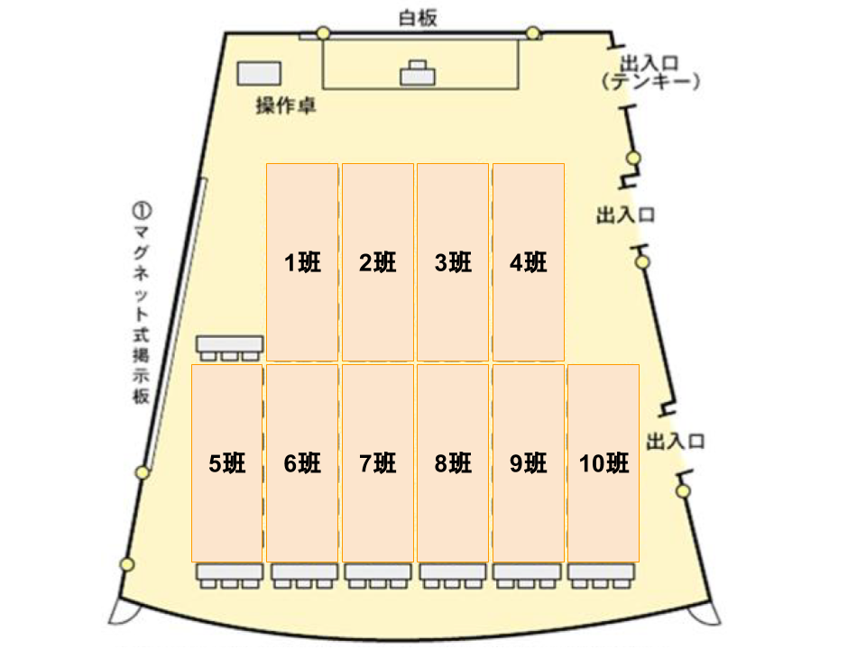

### 以下のように座ってください
</img>

---

<!-- .element data-background="image/marshmallow-coffee.jpg" -->
# マシュマロ チャレンジ
___
@Note:
マシュマロチャレンジを知っているかどうか聞く

---

<!-- .element data-background="image/skytree.jpg" -->

## マシュマロチャレンジとは？
___
- チーム対抗で **より高いタワーを立てる** ゲーム<!-- .element: class="fragment" data-fragment-index="1" -->
- 使えるのは **パスタとテープとひも** だけ<!-- .element: class="fragment" data-fragment-index="2" -->
- 最後に **マシュマロ** を一番上に乗せて倒れないように!<!-- .element: class="fragment" data-fragment-index="3" -->
- 世界記録は **99cm** !!<!-- .element: class="fragment" data-fragment-index="4" -->

---

<!-- .element data-background="image/skytree.jpg" -->

## ルール説明
___
パスタ・テープ・ひもでタワーを作り、<!-- .element: class="fragment" data-fragment-index="1" -->

タワーの一番上にマシュマロを置いたときに、<!-- .element: class="fragment" data-fragment-index="2" -->

一番高い班が優勝！<!-- .element: class="fragment" data-fragment-index="3" -->

>>>

<!-- .element data-background="image/enjin_people.png" data-background-color="#A5D6A7" -->

### チーム分け
___
各班を3つのチームに分ける<!-- .element: class="fragment" data-fragment-index="1" -->

4 or 5 人で 1 チーム<!-- .element: class="fragment" data-fragment-index="1" -->

**3つのチームの高さの合計で、各班の順位を決定！**<!-- .element: class="fragment" data-fragment-index="2" -->

**次のゲームと合わせて、上位の班には豪華賞品をプレゼント！！**<!-- .element: class="fragment" data-fragment-index="3" -->

@Note:
ここでチーム分けをしてしまう。各TAさんお願いします。

>>>

<!-- .element data-background="image/timer.png" data-background-size="50%" data-background-color="#C5E1A5" -->

### 制限時間
___
#### プレイ時間は 15分<!-- .element: class="fragment" data-fragment-index="1" -->
- 作戦タイム: 3分<!-- .element: class="fragment" data-fragment-index="2" -->
- 建築タイム: 12分<!-- .element: class="fragment" data-fragment-index="3" -->

(建築タイム中の話し合いはOK)<!-- .element: class="fragment" data-fragment-index="4" -->

@Note:
このあたりを説明しながら、各TAに材料と道具を配ってもらう。

>>>

<!-- .element data-background="image/goods.jpg" -->

## 材料・道具

|||
|:----------|:---------:|
| マシュマロ | 1個 |
| 乾燥パスタ | 20本 |
| マスキングテープ | 90cm |
| ひも | 90cm |
| はさみ | 1本 |
|||

>>>

<!-- .element data-background="image/caution.png" data-background-size="50%" data-background-color="#E6EE9C" -->

### 注意事項
___
- パスタ、テープ、ひもを切り貼りするのはOK
- **足場と机をテープで固定してはいけない**
- マシュマロは、建築タイム内にタワーの上に置くか刺す
- **マシュマロを切ったり食べたりしてはいけない**
- 建築タイム終了時、すぐに手を離すこと
- **計測までにタワーが倒れたら、記録なし**

---

<!-- .element data-background="image/skytree.jpg" -->

## 準備はいいですか？？
___
- プレイ時間は15分（作戦3分、建築12分)
- テープで足場と机を固定してはいけない
- マシュマロは一番上に
- 計測の間もタワーは自立していること
- 3チームの合計で一番高い班の優勝！

***上位の班には豪華賞品があります!!!***

@Note:
タイマーを用意 (3分、15分)

---

<!-- .element data-background="image/skytree.jpg" -->

## 測定中...
___
しばらくお待ち下さい...

@Note:
集計結果をSpreadSheetにまとめる。
結果をすぐにスライドに打ち込み

>>>

<!-- .element data-background="image/skytree.jpg" -->

## 結果発表！！
___
|||||
|:-:|:-:|:-:|:-:|
|4位|[7pt]|班<!-- .element: class="fragment" data-fragment-index="7" -->|( cm)<!-- .element: class="fragment" data-fragment-index="7" -->|
|5位|[6pt]|班<!-- .element: class="fragment" data-fragment-index="6" -->|( cm)<!-- .element: class="fragment" data-fragment-index="6" -->|
|6位|[5pt]|班<!-- .element: class="fragment" data-fragment-index="5" -->|( cm)<!-- .element: class="fragment" data-fragment-index="5" -->|
|7位|[4pt]|班<!-- .element: class="fragment" data-fragment-index="4" -->|( cm)<!-- .element: class="fragment" data-fragment-index="4" -->|
|8位|[3pt]|班<!-- .element: class="fragment" data-fragment-index="3" -->|( cm)<!-- .element: class="fragment" data-fragment-index="3" -->|
|9位|[2pt]|班<!-- .element: class="fragment" data-fragment-index="2" -->|( cm)<!-- .element: class="fragment" data-fragment-index="2" -->|
|10位|[1pt]|班<!-- .element: class="fragment" data-fragment-index="1" -->|( cm)<!-- .element: class="fragment" data-fragment-index="1" -->|

>>>

<!-- .element data-background="image/skytree.jpg" -->

## 結果発表！！
___
<table class="table-big">
<tr>
    <th>1位</th>
    <th>[10pt]</th>
    <th>1班<!-- .element: class="fragment" data-fragment-index="3" --></th>
    <th>(300cm)<!-- .element: class="fragment" data-fragment-index="3" --></th>
</tr>
    <th>2位</th>
    <th>[9pt]</th>
    <th>2班<!-- .element: class="fragment" data-fragment-index="2" --></th>
    <th>(200cm)<!-- .element: class="fragment" data-fragment-index="2" --></th>
</tr>
<tr>
    <th>3位</th>
    <th>[8pt]</th>
    <th>3班<!-- .element: class="fragment" data-fragment-index="1" --></th>
    <th>(200cm)<!-- .element: class="fragment" data-fragment-index="1" --></th>
</tr>
</table>

---

<!-- .element data-background="image/ted.png" -->

## 実は...
___
- このゲームは、**企業のアイスブレイクやオリエンテーション**で実際に行われています
- **幼稚園児の記録のほうが、大人よりも良い**
- 計画も大事だが、**アイディアを出しながら役割分担して試行錯誤すること**も大事です

---

<!-- .element data-background="image/marshmallow-coffee.jpg" -->

## マシュマロチャレンジ
___
~ おしまい ~